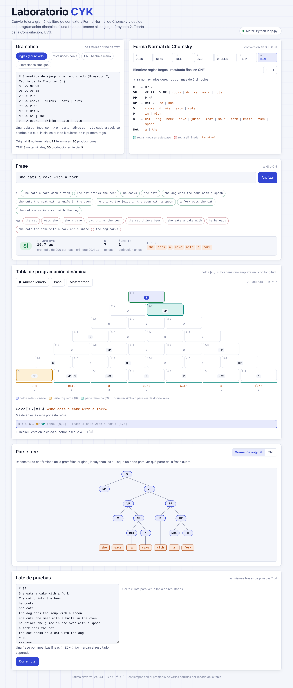
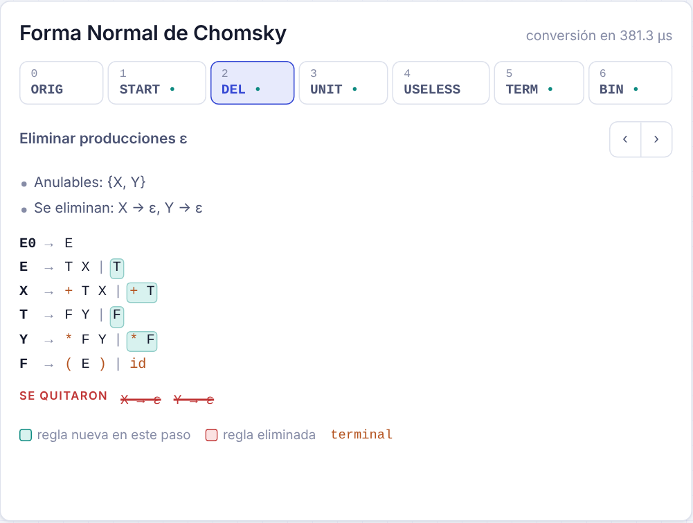
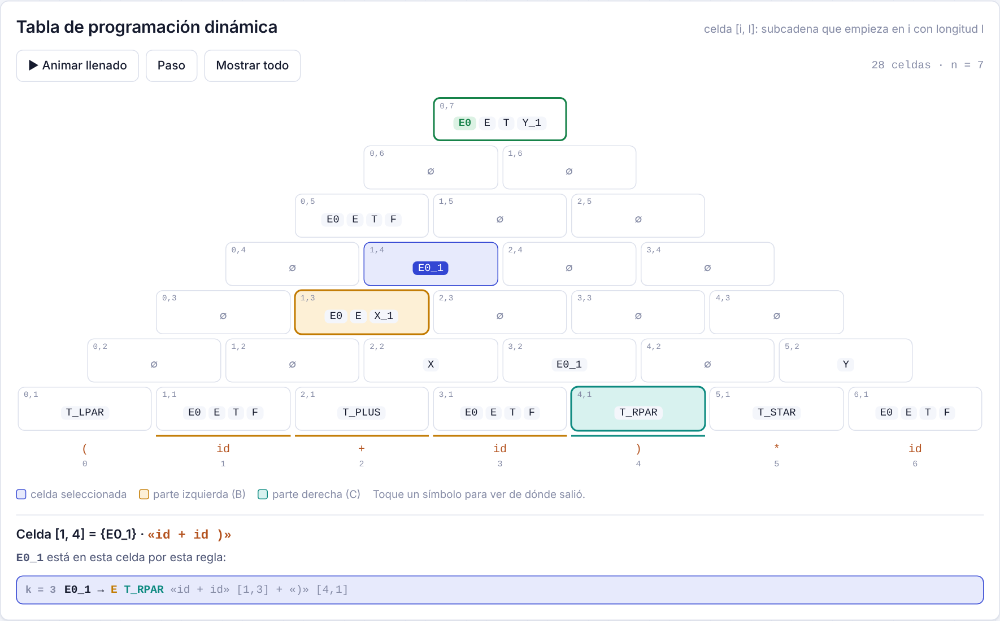
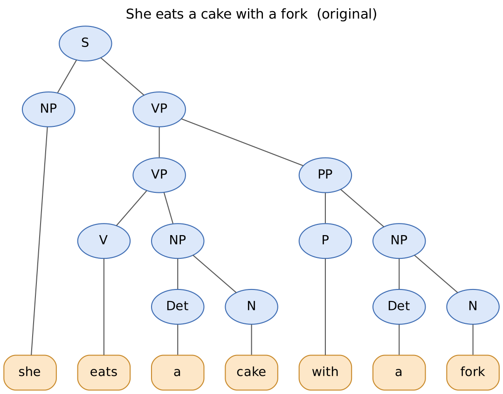
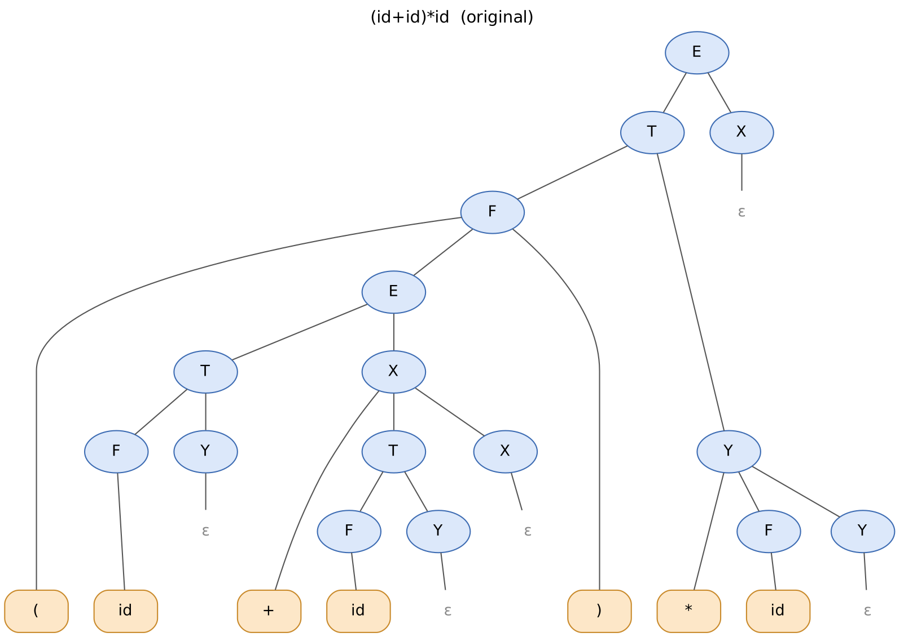
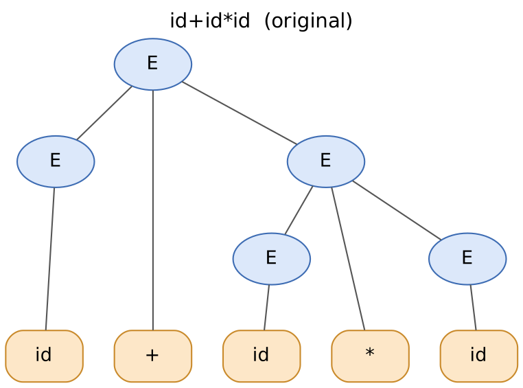
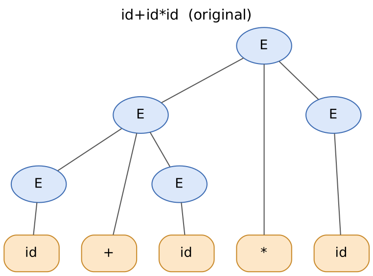
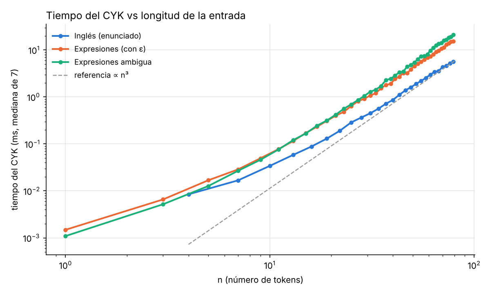

# Proyecto 2: Algoritmo CYK

**Teoría de la Computación, Universidad del Valle de Guatemala**

Programa que recibe **cualquier** gramática libre de contexto en un `.txt`, la
simplifica y la convierte a **Forma Normal de Chomsky (CNF)**, y luego usa el
**algoritmo CYK** (programación dinámica) para decidir si una frase `w`
pertenece al lenguaje. Para cada frase reporta:

* **SÍ / NO**
* **tiempo** que tarda el CYK en validar
* la **tabla de programación dinámica**
* el **parse tree**, tanto en la gramática CNF como reconstruido en la
  **gramática original** (con sus ε incluidas), en texto y en imagen (Graphviz)
* el **número de árboles** distintos (detecta frases ambiguas)

Además tiene una **interfaz visual** (`python3 app.py`) con la conversión a CNF
paso a paso, la pirámide del CYK animada y el árbol interactivo (sección 4).

No usa librerías externas para el algoritmo: solo Python 3.10+ estándar.
Graphviz (`dot`) es opcional, para las imágenes, y matplotlib solo para la
gráfica de tiempos.

---

## 1. Cómo ejecutarlo

```bash
# Una frase
python3 main.py grammars/ingles.txt "She eats a cake with a fork"

# Ver la conversión a CNF paso a paso y la tabla CYK
python3 main.py grammars/expresiones.txt "(id+id)*id" --pasos --tabla

# Guardar los árboles como imagen (.png) en una carpeta
python3 main.py grammars/ingles.txt "The cat drinks the beer" --png salida/

# Un archivo con varias frases (una por línea) y tabla resumen
python3 main.py grammars/ingles.txt -f pruebas/frases_ingles.txt

# Frase ambigua: mostrar varios árboles
python3 main.py grammars/ambigua.txt "id+id*id" --todos 5

# Modo interactivo (sin frase)
python3 main.py grammars/ingles.txt

# Interfaz visual en el navegador (usa el mismo motor Python)
python3 app.py

# Pruebas automáticas y gráfica de tiempos
python3 -m unittest -v
python3 benchmark.py
```

| Opción | Qué hace |
|---|---|
| `--pasos` | imprime la gramática después de cada paso de la conversión |
| `--cnf` | imprime solo la gramática final en CNF |
| `--tabla` | imprime la tabla triangular del CYK |
| `--todos N` | muestra hasta N parse trees si la frase es ambigua |
| `--png DIR` | guarda cada árbol como `.dot` y `.png` |
| `--repetir N` | corre el CYK N veces y reporta la mediana del tiempo |
| `--guardar-cnf F` | escribe la CNF resultante en un `.txt` |
| `--sin-cnf` | no imprime el árbol en CNF, solo el original |

Para instalar Graphviz en macOS: `brew install graphviz`.

### Formato de la gramática

```
# comentario
S  -> NP VP
VP -> VP PP | V NP | cooks | drinks
X  -> + T X | e
```

* Flecha `->`, `→` o `::=`. Alternativas con `|`. Símbolos separados por espacios.
* Es **no terminal** todo lo que aparece a la izquierda de alguna regla; lo demás es terminal.
* El **símbolo inicial** es el lado izquierdo de la primera regla.
* `e`, `ε`, `eps` o `λ` sola representa la cadena vacía.

---

## 2. Estructura

```
main.py                 interfaz de línea de comandos
app.py                  interfaz visual: servidor local con el motor Python
benchmark.py            mide tiempo vs n y genera ejemplos/tiempos_cyk.png
build_presets.py        genera web/presets.js desde grammars/ y pruebas/
cfg/
  grammar.py            clase Grammar, lectura del .txt
  cnf.py                simplificación y conversión a CNF (6 pasos)
  cyk.py                algoritmo CYK, conteo de árboles y reconstrucción
  tree.py               árboles, patrones, impresión ASCII y Graphviz
  tokenizer.py          frase -> lista de terminales
  export.py             resultado completo en JSON para la interfaz
web/
  index.html            la interfaz visual
  cyk-engine.js         el mismo motor traducido a JavaScript (para usarla sin Python)
  presets.js            gramáticas y frases de ejemplo (generado)
grammars/
  ingles.txt            gramática del enunciado
  expresiones.txt       expresiones aritméticas con producciones ε
  expresiones_cnf_manual.txt   CNF hecha a mano de la anterior
  ambigua.txt           E -> E + E | E * E | ( E ) | id
pruebas/                frases de prueba (las que sí y las que no)
tests/                  pruebas automáticas (unittest) y oráculo de Earley
ejemplos/               salidas reales del programa, árboles .png y gráfica
```

---

## 3. Diseño

El programa es un pipeline de cuatro etapas:

```
 .txt ──► parse_grammar ──► to_cnf (6 pasos) ──► tokenize(w) ──► cyk ──► SÍ/NO, tiempo,
                                                                         tabla, árboles
```

### 3.1 Representación

* `Grammar`: símbolo inicial + diccionario `A -> [Production]`, conservando el
  orden de aparición para que la salida sea determinista y legible.
* `Production(lhs, rhs, pattern)`: `rhs` es una tupla de símbolos (vacía = ε).
  `pattern` es la pieza clave para reconstruir el árbol original (sección 3.4).

### 3.2 Simplificación y conversión a CNF

Una gramática está en CNF si toda producción es `A → B C`, `A → a` o
`S → ε` (solo el inicial, y el inicial no aparece a la derecha).
La conversión se hace en este orden:

| # | Paso | Qué hace |
|---|---|---|
| 1 | **START** | Si el inicial `S` aparece en algún lado derecho, se agrega `S0 → S`. |
| 2 | **DEL** | Calcula los **anulables** (punto fijo) y, para cada regla, genera todas las combinaciones quitando símbolos anulables. Elimina `A → ε` excepto `S0 → ε` si ε ∈ L(G). |
| 3 | **UNIT** | Para cada `A`, recorre con BFS los **pares unitarios** `A ⇒* B` (maneja ciclos como `A → B`, `B → A`) y copia a `A` las reglas no unitarias de `B`. |
| 4 | **USELESS** | Quita los símbolos **no generadores** (no llegan a una cadena de terminales) y luego los **no alcanzables** desde el inicial. |
| 5 | **TERM** | En reglas de longitud ≥ 2 reemplaza cada terminal `a` por un nuevo `T_a → a`. |
| 6 | **BIN** | Parte `A → X1 X2 … Xn` en `A → X1 A_1`, `A_1 → X2 A_2`, … Colas idénticas comparten auxiliar. |

**Por qué ese orden.** DEL puede crear reglas unitarias (`E → T X` con `X`
anulable crea `E → T`), así que UNIT va después. UNIT y DEL pueden dejar
símbolos inútiles, así que USELESS va después de ambos. TERM y BIN van al
final porque solo reacomodan y nunca crean ε, unitarias ni símbolos inútiles.
Hacer BIN antes de DEL también funciona pero produce más reglas.

Los nombres nuevos (`S0`, `T_PLUS`, `X_1`, …) se verifican contra todos los
símbolos existentes, así que no chocan aunque la gramática ya use esos nombres.
Al final, `is_cnf()` valida que el resultado realmente esté en CNF.

**Ejemplo** (`python3 main.py grammars/expresiones.txt --pasos`, salida completa en
`ejemplos/conversion_cnf_expresiones.txt`):

```
Original                 DEL (anulables: X, Y)       UNIT                         CNF final
E → T X                  E0 → E                      E0 → T X | F Y | ( E ) | id   E0     → T X | F Y | T_LPAR E0_1 | id
X → + T X | ε            E  → T X | T                E  → T X | F Y | ( E ) | id   E      → T X | F Y | T_LPAR E0_1 | id
T → F Y                  X  → + T X | + T            X  → + T X | + T              X      → T_PLUS X_1 | T_PLUS T
Y → * F Y | ε            T  → F Y | F                T  → F Y | ( E ) | id         T      → F Y | T_LPAR E0_1 | id
F → ( E ) | id           Y  → * F Y | * F            Y  → * F Y | * F              Y      → T_STAR Y_1 | T_STAR F
                         F  → ( E ) | id             F  → ( E ) | id               F      → T_LPAR E0_1 | id
                                                                                   T_LPAR → (     T_RPAR → )
                                                                                   T_PLUS → +     T_STAR → *
                                                                                   E0_1 → E T_RPAR
                                                                                   X_1  → T X
                                                                                   Y_1  → F Y
```

La gramática del enunciado ya está casi en CNF: no tiene ε, unitarias, inútiles
ni reglas largas; el programa lo detecta y la deja igual (`S` no aparece a la
derecha, así que tampoco hace falta `S0`).

### 3.3 Algoritmo CYK (programación dinámica)

Sea `w = a1 … an`. La tabla `T[i][l]` contiene los no terminales que derivan la
subcadena de longitud `l` que empieza en la posición `i`:

* **Caso base (l = 1):** `T[i][1] = { A | A → a_i }`
* **Recurrencia (l ≥ 2):** `T[i][l] = { A | A → B C, B ∈ T[i][k], C ∈ T[i+k][l−k], 1 ≤ k < l }`
* **Respuesta:** `w ∈ L(G)` si y solo si `S ∈ T[0][n]`. Para `w = ε` se acepta si existe `S → ε`.

Es programación dinámica porque cada celda se calcula **una sola vez** a partir
de celdas de subcadenas más cortas, que ya están resueltas (subestructura
óptima + subproblemas superpuestos). Se llena por longitud creciente.

En lugar de un booleano, cada celda guarda para cada `A` la lista de
**backpointers** `(producción, k)`, que dicen *cómo* se obtuvo. Con eso:

* el **parse tree** se reconstruye bajando desde `S ∈ T[0][n]`;
* el **número de árboles** se calcula en la misma pasada:
  `cuenta[i][l][A] = Σ cuenta[i][k][B] · cuenta[i+k][l−k][C]`;
* `--todos N` enumera de forma perezosa hasta N árboles distintos.

Para acelerar la recurrencia, las producciones `A → B C` se indexan por el par
`(B, C)`, así que para cada par de celdas solo se miran las reglas que aplican.

**Complejidad:** tiempo O(n³ · |G|), espacio O(n² · |V|).

**Tiempo reportado:** se mide con `time.perf_counter_ns()` solo alrededor del
llenado de la tabla (sin contar la lectura de la gramática, la conversión a CNF
ni la impresión). La conversión a CNF se reporta por separado porque se hace
una sola vez por gramática.

### 3.4 Reconstrucción del árbol en la gramática original

El árbol que sale del CYK está en términos de la CNF (con `T_PLUS`, `X_1`, etc.,
y sin las ε). Para mostrar también el árbol de la **gramática original**, cada
producción lleva un **patrón**: un fragmento de árbol de la gramática original
con huecos `Slot(i)` donde van los hijos. Cada paso de la conversión transforma
el patrón junto con la producción:

* **Original:** `X → + T X` tiene patrón `X(slot0, slot1, slot2)`.
* **DEL:** al quitar el `X` anulable se obtiene `X → + T` con patrón
  `X(slot0, slot1, X(ε))`: el hueco se llena con un árbol testigo de `X ⇒* ε`.
* **UNIT:** `E → F Y` (copiado vía `E ⇒ T`) tiene patrón `E(T(slot0, slot1), X(ε))`.
* **TERM / BIN:** `T_a` y los auxiliares `A_k` son "transparentes": pasan sus
  hijos tal cual al padre.

Al terminar el CYK se recorre el árbol CNF y se llenan los patrones de abajo
hacia arriba. Las pruebas verifican que **cada nodo** del árbol resultante sea
una producción de la gramática original y que sus hojas sean exactamente `w`.

### 3.5 Tokenización

La frase se separa por espacios; si un pedazo no es terminal, se separa en
palabras y signos (`(id+id)*id` → `( id + id ) * id`). Se ignoran
mayúsculas si no hay coincidencia exacta (`She` → `she`) y un punto final.
Si una palabra no está en el alfabeto Σ, la respuesta es **NO** de inmediato.

---

## 4. Interfaz visual

```bash
python3 app.py              # abre http://localhost:8000
```

`app.py` es un servidor local (solo biblioteca estándar) que sirve `web/` y
responde `POST /api/analyze` con el **mismo motor Python** de `cfg/`. La
insignia de la esquina dice qué motor está en uso.



Qué se puede hacer:

* **Gramática:** elegir una de ejemplo o escribir cualquier otra; se vuelve a convertir mientras se escribe.
* **Forma Normal de Chomsky:** recorrer los 7 estados (original y los 6 pasos). En cada uno se resaltan las reglas **nuevas** y se listan las **eliminadas**, con las notas del paso (anulables, pares unitarios, auxiliares).
* **Frase:** SÍ/NO, tiempo del CYK, número de tokens y número de árboles. Hay ejemplos que sí y que no están en el lenguaje para probar con un toque.
* **Tabla de programación dinámica** dibujada como pirámide: cada celda `[i, l]` está justo encima de las palabras que cubre. Se puede **animar el llenado** celda por celda o avanzar con **Paso**; para cada celda se muestran los cortes `k` probados y qué reglas `A → B C` aplicaron. Al tocar un símbolo se iluminan las dos celdas de donde salió (B en ámbar, C en verde azulado).
* **Parse tree** en la gramática original o en CNF. Al tocar un nodo se ilumina en la tabla la subcadena que cubre. Si la frase es ambigua se puede navegar entre los árboles.
* **Lote de pruebas:** corre todas las frases de `pruebas/*.txt` y compara con el resultado esperado.

| Pasos de la CNF (DEL en expresiones) | Tabla CYK con un símbolo seleccionado |
|---|---|
|  |  |

**Uso sin Python.** La página también funciona abierta sola (por ejemplo,
publicada en la web), porque trae `web/cyk-engine.js`, una traducción directa
del motor Python a JavaScript. Para que no sea "otra implementación" que pueda
dar resultados distintos, `tests/test_engines.py` corre ambos motores sobre
miles de casos (todas las gramáticas, todas las frases de prueba, 150
gramáticas aleatorias con todas sus cadenas cortas, errores de sintaxis) y
exige que el JSON de salida sea **idéntico**: mismos pasos de la CNF, misma
tabla, mismo conteo y mismos árboles.

---

## 5. Ejemplos y pruebas

### 5.1 Gramática del enunciado

```
$ python3 main.py grammars/ingles.txt "She eats a cake with a fork" --tabla

Tokens:    [she, eats, a, cake, with, a, fork]  (n = 7)
Resultado: SÍ
Tiempo CYK: 39.16 µs

+-----+-------+---------+-------+--------+--------+-------+--------+
|     | 0:she | 1:eats  | 2:a   | 3:cake | 4:with | 5:a   | 6:fork |
+-----+-------+---------+-------+--------+--------+-------+--------+
| l=7 | {S}   |         |       |        |        |       |        |
| l=6 | ∅     | {VP}    |       |        |        |       |        |
| l=5 | ∅     | ∅       | ∅     |        |        |       |        |
| l=4 | {S}   | ∅       | ∅     | ∅      |        |       |        |
| l=3 | ∅     | {VP}    | ∅     | ∅      | {PP}   |       |        |
| l=2 | {S}   | ∅       | {NP}  | ∅      | ∅      | {NP}  |        |
| l=1 | {NP}  | {V, VP} | {Det} | {N}    | {P}    | {Det} | {N}    |
+-----+-------+---------+-------+--------+--------+-------+--------+
Árboles de derivación: 1

S
├── NP
│   └── she
└── VP
    ├── VP
    │   ├── V
    │   │   └── eats
    │   └── NP
    │       ├── Det
    │       │   └── a
    │       └── N
    │           └── cake
    └── PP
        ├── P
        │   └── with
        └── NP
            ├── Det
            │   └── a
            └── N
                └── fork
```



Resultado de `python3 main.py grammars/ingles.txt -f pruebas/frases_ingles.txt`:

| Frase | n | Resultado | Por qué |
|---|---|---|---|
| She eats a cake with a fork | 7 | **SÍ** | ejemplo del enunciado |
| The cat drinks the beer | 5 | **SÍ** | ejemplo del enunciado |
| he cooks | 2 | **SÍ** | `VP → cooks` |
| she eats | 2 | **SÍ** | `VP → eats` |
| the dog eats the soup with a spoon | 8 | **SÍ** | `VP → VP PP` |
| she cuts the meat with a knife in the oven | 10 | **SÍ** | dos PP seguidos |
| he drinks the juice in the oven with a spoon | 10 | **SÍ** | dos PP seguidos |
| a fork eats the cat | 5 | **SÍ** | sintácticamente correcta, semánticamente absurda |
| the cat cooks in a cat with the dog | 9 | **SÍ** | igual, sintaxis válida |
| the cat | 2 | NO | falta el VP |
| eats she | 2 | NO | orden incorrecto |
| she a cake | 3 | NO | falta el verbo |
| cat drinks the beer | 4 | NO | `N` sin determinante |
| the cat drinks beer | 4 | NO | `NP → Det N`, no `N` solo |
| she eats a cake with | 5 | NO | PP incompleto |
| he he eats | 3 | NO | dos sujetos |
| she eats the cake with a fork and a knife | – | NO | `and` ∉ Σ |
| the dog barks | – | NO | `barks` ∉ Σ |

Observación: la gramática no tiene `NP → NP PP`, así que en
"She eats a cake with a fork" el PP solo puede modificar al verbo
(comer *usando* un tenedor), no al pastel. Por eso hay un solo árbol.

### 5.2 Gramática de expresiones (con ε)

```
$ python3 main.py grammars/expresiones.txt "(id+id)*id"
Resultado: SÍ
```

Árbol reconstruido en la gramática original, con las ε:



| Frase | Resultado | | Frase | Resultado |
|---|---|---|---|---|
| `id` | **SÍ** | | `ε` (vacía) | NO |
| `id + id` | **SÍ** | | `id +` | NO |
| `id * id` | **SÍ** | | `+ id` | NO |
| `(id+id)*id` | **SÍ** | | `(id` | NO |
| `id+id*id` | **SÍ** | | `id id` | NO |
| `((id))` | **SÍ** | | `()` | NO |
| `id*(id+id*id)+id` | **SÍ** | | `id**id` | NO |
| `(((id)+id)*(id))` | **SÍ** | | `id+*id` | NO |
| | | | `x + id` | NO (`x` ∉ Σ) |

### 5.3 Frases ambiguas

Con `E → E + E | E * E | ( E ) | id`, la frase `id+id*id` tiene 2 árboles
(el programa lo reporta como **AMBIGUA** y con `--todos 2` muestra ambos):

| `[E [E id] + [E [E id] * [E id]]]` | `[E [E [E id] + [E id]] * [E id]]` |
|---|---|
|  |  |

El conteo coincide con los números de Catalan: `id (+ id)^m` tiene C(m)
árboles (1, 1, 2, 5, 14, 42, …); para n = 79 tokens son
680 425 371 729 975 800 390 árboles, y el CYK los cuenta en ~20 ms sin
construirlos.

### 5.4 Tiempo vs longitud

`python3 benchmark.py` mide la mediana de 7 corridas para entradas cada vez
más largas. En escala log-log las curvas tienden a la pendiente de n³, como
predice la teoría:



| n | Inglés | Expresiones | Ambigua |
|---|---|---|---|
| 7 | 0.017 ms | 0.029 ms | 0.025 ms |
| 40 / 41 | 0.83 ms | 2.4 ms | 2.9 ms |
| 76 / 77 | 5.0 ms | 13.9 ms | 18.4 ms |

(Mediciones en el entorno de desarrollo; los valores absolutos cambian según la
máquina, lo que importa es la forma de la curva.)

### 5.5 Pruebas automáticas (`python3 -m unittest -v`, 17 pruebas)

La forma más fuerte de probar que la conversión no cambió el lenguaje es
compararla contra un algoritmo **independiente**. En `tests/earley.py` hay un
reconocedor de **Earley** que trabaja directo con la gramática original
(con ε y unitarias). Las pruebas comparan CYK(CNF(G)) contra Earley(G):

* **Expresiones:** las 97 656 cadenas posibles de longitud ≤ 7 sobre `{id, +, *, (, )}`.
* **Inglés:** todas las cadenas de longitud ≤ 3 sobre las 21 palabras (9 724) y 3 000 frases aleatorias de 4 a 12 palabras.
* **500 frases generadas** al azar desde la gramática del inglés: todas deben dar SÍ.
* **400 gramáticas aleatorias** con ε, unitarias, ciclos y símbolos inútiles, todas las cadenas sobre `{a, b}` de longitud ≤ 6.
* En cada SÍ, el árbol reconstruido usa solo producciones de la gramática original y su frontera es exactamente `w`.
* **Catalan:** el conteo de árboles de la gramática ambigua coincide para m = 0 … 7 y todos los árboles enumerados son distintos.
* **CNF manual vs automática:** `expresiones_cnf_manual.txt` y la CNF generada aceptan exactamente las mismas cadenas (longitud ≤ 7).
* **Motor JavaScript vs Python:** salida JSON idéntica en todos los casos (sección 4); y `web/presets.js` coincide con `grammars/` y `pruebas/`.
* Casos borde: lenguaje con ε (`S → a S b | e`), lenguaje vacío, ciclos unitarios, choques de nombres (`T_PLUS` o `S0` ya existentes).

```
Ran 17 tests in 26.5s
OK
```

### 5.6 CNF manual vs la del programa

La CNF hecha a mano y la generada son la **misma** salvo nombres:

| Manual | Programa |
|---|---|
| `E → T X \| F Y \| L Z \| id` | `E → T X \| F Y \| T_LPAR E0_1 \| id` |
| `Z → E R` | `E0_1 → E T_RPAR` |
| `W → T X` | `X_1 → T X` |
| `V → F Y` | `Y_1 → F Y` |
| `L → (`, `R → )`, `P → +`, `M → *` | `T_LPAR`, `T_RPAR`, `T_PLUS`, `T_STAR` |

La única diferencia real es que el programa agrega `E0` porque `E` aparece a
la derecha (en `Z → E R`). Según la definición estricta de CNF, el inicial no
debe aparecer en un lado derecho; para el CYK no afecta (`E0` tiene las mismas
reglas que `E`), pero lo dejamos para cumplir la definición formal.

---

## 6. Discusión

### Obstáculos encontrados

* **El orden de los pasos importa.** Eliminar ε crea unitarias nuevas
  (`E → T` sale de `E → T X`), y eliminar unitarias puede dejar símbolos
  inalcanzables. Si se hace UNIT antes que DEL, la gramática resultante
  puede quedar con unitarias. Por eso DEL va antes de UNIT y USELESS al final
  de los tres.
* **El símbolo inicial a la derecha.** En `expresiones.txt`, `E` aparece en
  `F → ( E )`. Sin `E0`, conservar `E → ε` (si el lenguaje tuviera ε) metería
  la cadena vacía dentro de los paréntesis. El paso START lo evita.
* **Ciclos de unitarias** (`A → B`, `B → A`). Un recorrido recursivo ingenuo
  no termina; se resolvió con BFS y conjunto de visitados.
* **Explosión de DEL.** Una regla con k anulables genera hasta 2^k reglas.
  En gramáticas normales k es pequeño, pero conviene tenerlo presente.
* **El árbol "feo" en CNF.** El parse tree que sale del CYK tiene símbolos
  artificiales (`T_PLUS`, `X_1`) y no tiene las ε. Para que el resultado se
  entienda, se diseñó el sistema de patrones (sección 3.4) que lo traduce
  de vuelta a la gramática original. Fue la parte más delicada; por eso
  las pruebas verifican cada nodo contra la gramática original.
* **Medir tiempos tan pequeños.** Para frases cortas el CYK tarda decenas
  de microsegundos y la primera corrida suele ser más lenta (caché, intérprete).
  Se usa `perf_counter_ns` y la opción `--repetir N` reporta la mediana.
* **Ambigüedad.** El número de árboles crece exponencialmente (Catalan), así
  que no se pueden construir todos. Se cuentan con aritmética en la misma
  tabla y se enumeran de forma perezosa solo los que se piden.
* **Dos motores que deben coincidir.** Para que la interfaz funcione sin
  Python hubo que traducir el motor a JavaScript, y eso abre la puerta a
  diferencias sutiles (orden de iteración de diccionarios, enteros grandes,
  expresiones regulares con Unicode). Se resolvió comparando la salida JSON
  completa de ambos contra miles de casos; los conteos de árboles usan
  `BigInt` en JavaScript porque superan 2⁵³ rápidamente.
* **Resolución del reloj en el navegador.** `performance.now()` tiene una
  resolución limitada por seguridad, así que una sola corrida de pocos
  microsegundos se mide mal. Ambos motores repiten el CYK hasta acumular
  5 ms y reportan el promedio, además del tiempo de la primera corrida.
* **Tokenización.** `id+id` no tiene espacios y `She` lleva mayúscula; se
  agregó una tokenización que separa signos y es tolerante a mayúsculas.

### Recomendaciones

* Usar el CYK para **gramáticas pequeñas o medianas**: es O(n³) sin importar
  la gramática, lo cual es excelente para gramáticas ambiguas, pero para
  lenguajes de programación (LL/LR) los parsers lineales son mucho más rápidos.
* Al convertir a CNF a mano, verificar la equivalencia con pruebas
  exhaustivas sobre cadenas cortas, como se hizo aquí con Earley: es muy fácil
  olvidar una combinación de anulables.
* La gramática del enunciado podría ampliarse con `NP → NP PP` para permitir
  "a cake with a fork" como frase nominal; con eso "She eats a cake with a
  fork" se vuelve ambigua (2 árboles), un buen ejemplo de ambigüedad del
  lenguaje natural (prueben con `--todos 2`).

---

## 7. Referencias

* Hopcroft, Motwani y Ullman. *Introduction to Automata Theory, Languages, and Computation*, cap. 7 (formas normales y CYK).
* Sipser, M. *Introduction to the Theory of Computation*, sec. 2.1 y 7.2.
* Jurafsky y Martin. *Speech and Language Processing*, cap. 17 (CKY parsing).
* Aycock y Horspool (2002). *Practical Earley Parsing* (usado en el oráculo de pruebas).
